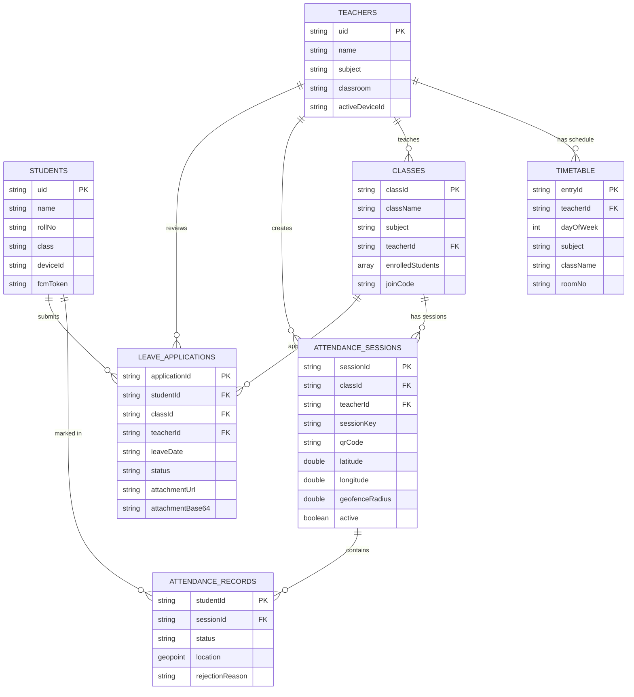

# QR-Attend 📱

> **Smart Attendance, Zero Proxy**

A secure, QR-code-based student attendance system for Android that prevents proxy attendance through multi-layer security: AES-256-GCM encrypted rotating QR codes, GPS geofencing, and hardware device fingerprinting.

---

## Table of Contents

- [Features](#features)
- [Security Architecture](#security-architecture)
- [Tech Stack](#tech-stack)
- [Project Structure](#project-structure)
- [Database Schema](#database-schema)
- [Setup & Installation](#setup--installation)
- [Usage](#usage)
- [Team](#team)

---

## Features

### Student
- 📷 **Scan QR** — Scan the teacher's live QR code to mark attendance
- 📊 **Attendance Dashboard** — View overall % and subject-wise breakdown with a donut chart
- 📅 **Attendance History** — Full log filterable by Present / Absent / Rejected / Leave
- 📝 **Apply for Leave** — Submit leave requests to a specific teacher with optional file attachment (PDF/image)
- 📋 **My Leaves** — Track status of all leave applications (Pending / Approved / Rejected)
- 🔗 **Join Class** — Enter a 6-character code to enroll in a class
- 🔒 **Device Binding** — One account = one device; rate-limited unbind (once per 30 days)

### Teacher
- 🟢 **Start Session** — Select class, pick duration, capture GPS location, generate session
- 📺 **Display QR** — Full-screen rotating QR code that refreshes every 10 seconds
- 👥 **Session Attendance** — Live list of all students who scanned, with status
- 📋 **Leave Applications** — Review, approve, or reject student leave requests with attachment viewing
- 🗓️ **Timetable** — Manage weekly class schedule with alarm-based reminders
- 📤 **Export CSV** — Export session attendance records

### Security
- 🔐 AES-256-GCM encrypted QR payloads with 10-second nonce rotation
- 📍 GPS geofencing (100m default radius) to ensure physical presence
- 📱 Hardware device fingerprinting to prevent account sharing
- 🛡️ Mock location detection
- ⏱️ 6-second nonce grace window prevents false rejection during GPS collection

---

## Security Architecture

```
┌─────────────────────────────────────────────────────────────┐
│                    ANTI-PROXY LAYERS                        │
├──────────────────────┬──────────────────────────────────────┤
│  Layer 1: QR Crypto  │  AES-256-GCM encrypted payload       │
│                      │  Nonce rotates every 10 seconds       │
│                      │  Session key stored server-side       │
├──────────────────────┼──────────────────────────────────────┤
│  Layer 2: Geofence   │  Student GPS must be within 100m of  │
│                      │  teacher's recorded classroom coords  │
│                      │  Mock location detection enabled      │
├──────────────────────┼──────────────────────────────────────┤
│  Layer 3: Device FP  │  SHA-256 hardware fingerprint bound   │
│                      │  to Firebase UID on first scan        │
│                      │  One device per account enforced      │
└──────────────────────┴──────────────────────────────────────┘
```

---

## Tech Stack

| Category | Technology |
|---|---|
| Language | Java (Android SDK) |
| Min SDK | Android 8.0 (API 26) |
| Target SDK | Android 14 (API 34) |
| Database | Firebase Firestore (NoSQL) |
| Auth | Firebase Authentication |
| Storage | Firebase Storage |
| Messaging | Firebase Cloud Messaging (FCM) |
| QR Generation | ZXing (`core` + `android-integration`) |
| QR Scanning | Google ML Kit Barcode Scanning |
| Camera | CameraX (androidx.camera) |
| Location | Google Play Services — Fused Location Provider |
| UI | Material Design 3 (MaterialComponents) |
| Charts | Custom `AttendanceDonutView` (Canvas drawing) |

---

## Project Structure

```
qrAttend/
├── app/
│   ├── src/main/
│   │   ├── AndroidManifest.xml
│   │   ├── java/com/qrattend/app/
│   │   │   │
│   │   │   ├── data/
│   │   │   │   ├── model/                    ← Firestore data models
│   │   │   │   │   ├── Student.java
│   │   │   │   │   ├── Teacher.java
│   │   │   │   │   ├── ClassInfo.java
│   │   │   │   │   ├── AttendanceSession.java
│   │   │   │   │   ├── AttendanceRecord.java
│   │   │   │   │   ├── LeaveApplication.java
│   │   │   │   │   └── TimetableEntry.java
│   │   │   │   │
│   │   │   │   └── repository/               ← Firestore CRUD operations
│   │   │   │       ├── StudentRepository.java
│   │   │   │       ├── TeacherRepository.java
│   │   │   │       ├── ClassRepository.java
│   │   │   │       ├── SessionRepository.java
│   │   │   │       ├── AttendanceRepository.java
│   │   │   │       ├── LeaveApplicationRepository.java
│   │   │   │       └── TimetableRepository.java
│   │   │   │
│   │   │   ├── firebase/
│   │   │   │   └── AuthManager.java          ← Firebase Auth wrapper
│   │   │   │
│   │   │   ├── location/
│   │   │   │   ├── LocationHelper.java       ← GPS fetch (quick + multi-sample)
│   │   │   │   └── GeoValidator.java         ← Geofence + mock location checks
│   │   │   │
│   │   │   ├── proxy/
│   │   │   │   └── ProxyDetectionEngine.java ← Orchestrates all 3 anti-proxy layers
│   │   │   │
│   │   │   ├── qr/
│   │   │   │   ├── QRGeneratorUtil.java      ← AES-encrypted QR bitmap generation
│   │   │   │   ├── QRScannerUtil.java        ← CameraX + ML Kit QR decoder
│   │   │   │   └── QRRefreshManager.java     ← 10-second nonce rotation timer
│   │   │   │
│   │   │   ├── security/
│   │   │   │   ├── AESCryptoUtil.java        ← AES-256-GCM encrypt/decrypt
│   │   │   │   ├── DeviceFingerprint.java    ← Hardware fingerprint generation
│   │   │   │   └── NonceManager.java         ← Nonce generation and validation
│   │   │   │
│   │   │   ├── timetable/
│   │   │   │   └── (timetable alarm/notification helpers)
│   │   │   │
│   │   │   ├── ui/
│   │   │   │   ├── SplashActivity.java       ← Animated splash + role routing
│   │   │   │   ├── LoginActivity.java
│   │   │   │   ├── SignupActivity.java
│   │   │   │   │
│   │   │   │   ├── ── Student ──
│   │   │   │   ├── StudentDashboardActivity.java
│   │   │   │   ├── ScanQRActivity.java       ← Camera + proxy validation + mark
│   │   │   │   ├── AttendanceHistoryActivity.java
│   │   │   │   ├── SubjectAttendanceActivity.java
│   │   │   │   ├── JoinClassActivity.java
│   │   │   │   ├── LeaveApplicationActivity.java  ← Submit leave
│   │   │   │   ├── MyLeavesActivity.java          ← Track leave status
│   │   │   │   │
│   │   │   │   ├── ── Teacher ──
│   │   │   │   ├── TeacherDashboardActivity.java
│   │   │   │   ├── StartSessionActivity.java      ← GPS + session config
│   │   │   │   ├── DisplayQRActivity.java         ← Live rotating QR display
│   │   │   │   ├── SessionAttendanceActivity.java ← Live student list
│   │   │   │   ├── ClassSessionsActivity.java
│   │   │   │   ├── LeaveApplicationsActivity.java ← Review + approve/reject
│   │   │   │   ├── TimetableActivity.java
│   │   │   │   │
│   │   │   │   ├── ── Shared ──
│   │   │   │   ├── SettingsActivity.java          ← Profile + device unbind
│   │   │   │   ├── AttendanceDonutView.java        ← Custom Canvas chart
│   │   │   │   │
│   │   │   │   └── adapters/
│   │   │   │       ├── AttendanceRecordAdapter.java
│   │   │   │       ├── ClassListAdapter.java
│   │   │   │       ├── ClassGroupAdapter.java
│   │   │   │       ├── EnrolledClassAdapter.java
│   │   │   │       ├── LeaveApplicationAdapter.java
│   │   │   │       ├── SessionListAdapter.java
│   │   │   │       ├── SubjectGroupAdapter.java
│   │   │   │       ├── TimetableEntryAdapter.java
│   │   │   │       └── UserListAdapter.java
│   │   │   │
│   │   │   └── utils/
│   │   │       ├── Constants.java            ← All Firestore collection names + config
│   │   │       ├── CsvExporter.java          ← Export attendance to CSV
│   │   │       ├── SnackbarHelper.java       ← Themed success/warning/error snackbars
│   │   │       └── ValidationResult.java     ← Proxy validation result wrapper
│   │   │
│   │   └── res/
│   │       ├── layout/                       ← XML layouts for all activities
│   │       ├── drawable/                     ← Icons, shapes, gradients
│   │       ├── values/
│   │       │   ├── colors.xml                ← Sapphire Precision design tokens
│   │       │   ├── strings.xml               ← All UI strings
│   │       │   ├── themes.xml                ← Material3 theme
│   │       │   └── styles.xml
│   │       └── xml/
│   │           ├── file_paths.xml            ← FileProvider config for attachments
│   │           ├── backup_rules.xml
│   │           └── data_extraction_rules.xml
│   │
│   └── build.gradle
│
├── build.gradle
├── google-services.json                      ← Firebase config (not committed)
└── README.md
```

---

## Database Schema

> **Database:** Cloud Firestore (NoSQL)  
> **Auth:** Firebase Authentication — UID is used as document ID for users

### Collection Overview

```
Firestore Root
├── students/{uid}
├── teachers/{uid}
│   └── timetable/{entryId}          ← subcollection
├── classes/{classId}
├── attendanceSessions/{sessionId}
│   └── records/{studentId}          ← subcollection
└── leaveApplications/{applicationId}
```

---

### `students/{uid}`

| Field | Type | Description |
|---|---|---|
| `name` | String | Full name |
| `rollNo` | String | Roll number |
| `class` | String | Class/batch name (`@PropertyName("class")`) |
| `email` | String | Email |
| `phone` | String | Phone number |
| `deviceId` | String | Primary hardware fingerprint (SHA-256) |
| `deviceId2` | String | Optional secondary fingerprint |
| `fcmToken` | String | FCM push token |
| `lastUnbindDate` | String | ISO date `yyyy-MM-dd` of last device unbind |

---

### `teachers/{uid}`

| Field | Type | Description |
|---|---|---|
| `name` | String | Full name |
| `email` | String | Email |
| `subject` | String | Primary subject |
| `classroom` | String | Default room (e.g. `"Room 301"`) |
| `fcmToken` | String | FCM push token |
| `deviceId` | String | Current device fingerprint |
| `activeDeviceId` | String | Set while a session runs; blocks other device logins |

---

### `teachers/{uid}/timetable/{entryId}`

| Field | Type | Description |
|---|---|---|
| `teacherId` | String | Parent teacher UID |
| `dayOfWeek` | int | 1 = Monday … 5 = Friday |
| `subject` | String | Subject name |
| `className` | String | Class/batch name |
| `roomNo` | String | Room identifier |
| `startHour` | int | 24h start hour |
| `startMinute` | int | Start minute |
| `endHour` | int | 24h end hour |
| `endMinute` | int | End minute |
| `notificationsEnabled` | boolean | Whether alarm fires |

---

### `classes/{classId}`

| Field | Type | Description |
|---|---|---|
| `className` | String | Batch name (e.g. `"TY BSc CS"`) |
| `subject` | String | Subject (e.g. `"DSA"`) |
| `teacherId` | String | → `teachers/{uid}` |
| `enrolledStudents` | Array\<String\> | List of student UIDs |
| `joinCode` | String | 6-char self-enrollment code |

---

### `attendanceSessions/{sessionId}`

| Field | Type | Description |
|---|---|---|
| `sessionId` | String | Auto-populated via `@DocumentId` |
| `classId` | String | → `classes/{classId}` |
| `className` | String | Denormalised |
| `subject` | String | Denormalised |
| `teacherId` | String | → `teachers/{uid}` |
| `sessionKey` | String | AES-256 encryption key |
| `qrCode` | String | Current encrypted QR token (rotates every 10s) |
| `previousQrCode` | String | Previous token (6s grace window) |
| `previousNonceExpiryMs` | long | Epoch ms when previous nonce expires |
| `latitude` | double | Teacher GPS latitude |
| `longitude` | double | Teacher GPS longitude |
| `geofenceRadius` | double | Allowed radius in metres (default 100m) |
| `startTime` | Timestamp | Session start |
| `endTime` | Timestamp | Session end (`null` if active) |
| `lectureStartTime` | Timestamp | Scheduled lecture start |
| `lectureEndTime` | Timestamp | Scheduled lecture end |
| `durationMinutes` | int | Used for auto-expiry |
| `active` | boolean | Accepting scans? |

---

### `attendanceSessions/{sessionId}/records/{studentId}`

> Doc ID = student UID → **guarantees one record per student per session**

| Field | Type | Description |
|---|---|---|
| `studentId` | String | → `students/{uid}` |
| `sessionId` | String | Parent session (denormalised) |
| `status` | String | `"present"` \| `"rejected"` |
| `time` | Timestamp | Marked at |
| `deviceId` | String | Fingerprint at scan time |
| `location` | GeoPoint | Student GPS at scan time |
| `rejectionReason` | String | e.g. `"location_mismatch"`, `"device_mismatch"` |
| `studentName` | String | Denormalised |
| `studentRollNo` | String | Denormalised |
| `subject` | String | Denormalised |

---

### `leaveApplications/{applicationId}`

| Field | Type | Description |
|---|---|---|
| `applicationId` | String | Document ID |
| `studentId` | String | → `students/{uid}` |
| `studentName` | String | Denormalised |
| `studentRollNo` | String | Denormalised |
| `classId` | String | → `classes/{classId}` |
| `className` | String | Denormalised |
| `teacherId` | String | → `teachers/{uid}` |
| `teacherName` | String | Denormalised |
| `subject` | String | Subject the leave is for |
| `leaveDate` | String | ISO date `yyyy-MM-dd` |
| `reason` | String | Student explanation |
| `status` | String | `"Pending"` \| `"Approved"` \| `"Rejected"` |
| `submittedAt` | Timestamp | Submission time |
| `attachmentUrl` | String | Firebase Storage URL (primary) |
| `attachmentFileName` | String | Original filename |
| `attachmentMimeType` | String | e.g. `"application/pdf"` |
| `attachmentBase64` | String | Base64 content (fallback) |
| `attachmentBase64MimeType` | String | MIME for base64 content |

---

### Entity Relationship Diagram



---

## Setup & Installation

### Prerequisites
- Android Studio Hedgehog or later
- Java 17+
- A Firebase project with **Firestore**, **Authentication**, **Storage**, and **FCM** enabled

### Steps

1. **Clone the repository**
   ```bash
   git clone https://github.com/<your-username>/qrAttend.git
   cd qrAttend
   ```

2. **Add Firebase config**  
   Download `google-services.json` from your Firebase console and place it at:
   ```
   app/google-services.json
   ```

3. **Firestore Security Rules**  
   Set your Firestore rules to allow authenticated reads/writes (adjust for production):
   ```
   rules_version = '2';
   service cloud.firestore {
     match /databases/{database}/documents {
       match /{document=**} {
         allow read, write: if request.auth != null;
       }
     }
   }
   ```

4. **Firebase Storage Rules** (for leave attachments)
   ```
   rules_version = '2';
   service firebase.storage {
     match /b/{bucket}/o {
       match /leaveProofs/{allPaths=**} {
         allow read, write: if request.auth != null
             && request.resource.size < 10 * 1024 * 1024;
       }
     }
   }
   ```

5. **Build & Run**
   ```bash
   ./gradlew assembleDebug
   # or open in Android Studio and Run
   ```

---

## Usage

### As a Teacher
1. Sign up → select **Teacher** role
2. Dashboard → **Start Session** → pick class, duration, get GPS
3. Show the rotating QR code to students
4. View live attendance on **Session Attendance** screen
5. End session when done

### As a Student
1. Sign up → select **Student** role
2. Join a class using the teacher's **join code** (or auto-enroll on first scan)
3. Dashboard → **Scan QR** → point camera at teacher's screen
4. Attendance is marked if you pass all 3 security checks
5. View your records in **Attendance History**

---

## Team

| Role | Responsibilities |
|---|---|
| Member 1 — UI & Integration Lead | Activities, layouts, Firebase integration |
| Member 2 — Core Logic & QR Lead | QR generation/scanning, CameraX, security |
| Member 3 — Backend & Data Lead | Firestore repositories, geofencing, sessions |

---

## License

This project was developed as an academic mini-project. All rights reserved by the development team.
