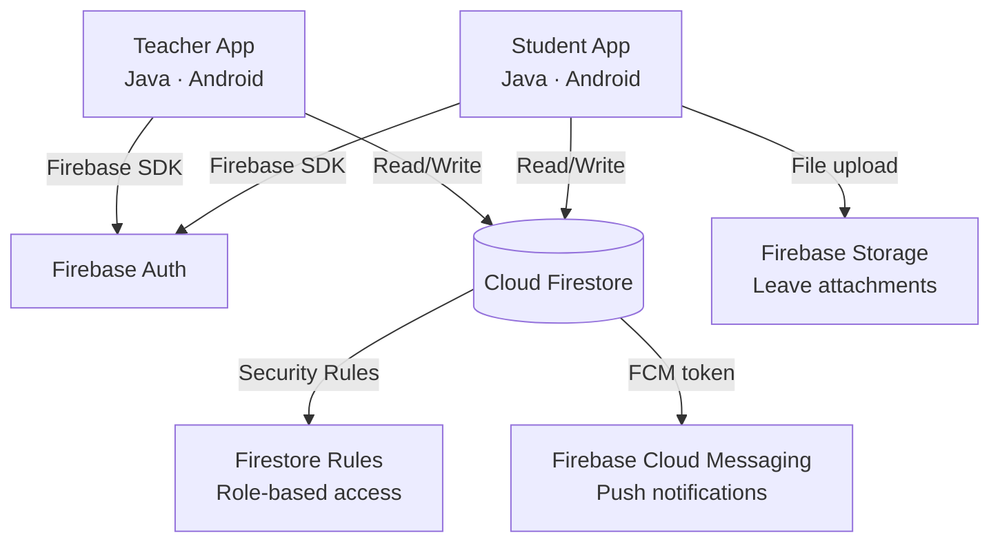

<div align="center">

# 📱 QR-Attend

### Dynamic QR Code Attendance System with Multi-Layer Proxy Prevention

[](https://developer.android.com)
[](https://www.java.com)
[](https://firebase.google.com)
[-blue)](https://developer.android.com/tools/releases/platforms)
[](LICENSE)

*Eliminating proxy attendance through device fingerprinting, GPS geofencing, and rotating encrypted QR codes.*

</div>

---

## 📖 Table of Contents

- [Overview](#overview)
- [Problem Statement](#problem-statement)
- [Key Features](#key-features)
- [How It Works](#how-it-works)
- [Architecture](#architecture)
- [Tech Stack](#tech-stack)
- [Firestore Data Model](#firestore-data-model)
- [Project Structure](#project-structure)
- [Security & Proxy Prevention](#security--proxy-prevention)
- [Screenshots / Flow](#screenshots--flow)
- [Setup & Installation](#setup--installation)
- [Team](#team)

---

## Overview

**QR-Attend** is an Android application that automates student attendance using **dynamic QR codes that rotate every 10 seconds**. The system combines device fingerprinting, GPS geofencing, and time-bound encrypted tokens to make proxy attendance virtually impossible.

| Metric | Target |
|---|---|
| Proxy detection rate | ≥ 98% |
| Attendance marking time | < 5 seconds per student |
| Data accuracy vs manual | < 1% discrepancy |
| Min Android version | Android 8.0 (API 26) |

---

## Problem Statement

| Pain Point | Impact |
|---|---|
| Manual roll-call is slow and error-prone | Wastes 5–10 min per lecture |
| Buddy-punching / proxy attendance | Inflated records, unfair grading |
| Paper registers are hard to audit | No analytics or real-time alerts |
| No visibility for absent students | Delayed intervention |

---

## Key Features

### 👨‍🏫 Teacher Side
- **Start attendance sessions** — select class, get GPS location, generate session
- **Full-screen dynamic QR code** — rotates every 10 seconds automatically
- **Real-time attendance count** — live updates as students scan in
- **Manual override** — long-press any student to mark Present / Absent / Leave
- **Session history** — view past sessions with date, count, and per-student detail
- **Leave application management** — approve/reject student leave with attachment viewing
- **Join code display** — class join codes shown on teacher dashboard cards

### 👩‍🎓 Student Side
- **QR scanner** — scan teacher's QR code to mark attendance in under 5 seconds
- **Auto-enrollment** — automatically added to a class on first valid scan
- **Attendance donut chart** — animated colour-coded ring (🟢 ≥75%, 🟡 ≥60%, 🔴 <60%) on dashboard
- **Subject-wise breakdown** — individual attendance % per subject
- **Attendance history** — filterable log with date, status, rejection reasons
- **Leave applications** — submit with class/teacher/date selection and file attachment (PDF/image)
- **My Leaves** — view all past applications with Approved / Rejected / Pending status

### 🔒 Security / Anti-Proxy
- **Device fingerprinting** — attendance bound to registered device (max 2 devices per student)
- **GPS geofencing** — 50 m radius around classroom, mock location detection
- **Rotating encrypted QR** — AES-256-GCM payload, 10-second nonce, one-time-use per student
- **Emulator / root detection** — auto-rejected
- **Auto-absent marking** — enrolled-but-absent students auto-marked when session ends

---

## How It Works

### Teacher starts a session

```
Teacher App
┌─────────────────────────────────────────────────────────┐
│  1. Select class → 2. Get GPS location                  │
│  3. Create session in Firestore                         │
│  4. Generate AES-256 key for this session               │
│  5. Display full-screen QR code                         │
│  ┌─────────────┐   every 10s    ┌────────────────────┐  │
│  │ QRRefreshMgr│─────────────▶  │ New nonce → encrypt │  │
│  │             │◀───────────── │ → render QR → Upd.  │  │
│  └─────────────┘   Firestore   └────────────────────┘  │
└─────────────────────────────────────────────────────────┘
```

### Student marks attendance

```
Student scans QR
       │
       ▼
Decrypt AES payload → extract sessionId + nonce
       │
       ├── ❌ Nonce expired (> 10s)          → Rejected: QR Expired
       ├── ❌ Device fingerprint mismatch    → Rejected: Device Mismatch  
       ├── ❌ GPS outside 50 m geofence      → Rejected: Location Mismatch
       ├── ❌ Mock/fake GPS detected          → Rejected: Mock Location
       ├── ❌ Rooted / emulator device        → Rejected: Device Not Trusted
       │
       └── ✅ All checks pass → Write attendance record to Firestore
```

---

## Architecture



> **Serverless architecture** — no custom backend. All logic runs client-side with Firebase as the data layer.

---

## Tech Stack

| Layer | Technology |
|---|---|
| **Language / IDE** | Java 17 · Android Studio |
| **UI** | XML Layouts · Material Design 3 Components |
| **Authentication** | Firebase Authentication (Email/Password + Google Sign-In) |
| **Database** | Cloud Firestore (real-time sync, subcollection model) |
| **File Storage** | Firebase Storage + Base64 Firestore fallback |
| **Push Notifications** | Firebase Cloud Messaging (FCM) |
| **QR Generation** | ZXing `zxing-android-embedded:4.3.0` |
| **QR Scanning** | Google ML Kit Barcode Scanning `17.3.0` |
| **Camera** | CameraX `1.3.1` |
| **Location** | Google Play Services Fused Location Provider `21.1.0` |
| **Encryption** | AES-256-GCM (`javax.crypto`) |
| **Analytics / Crashes** | Firebase Analytics + Crashlytics |
| **Min / Target SDK** | API 26 / API 35 |
| **Build** | Gradle · AGP |

---

## Firestore Data Model

```
Firestore Root
│
├── students/{studentId}
│   ├── name, rollNo, className, email, phone
│   ├── deviceId          # primary device fingerprint hash
│   ├── deviceId2         # optional 2nd device
│   └── fcmToken
│
├── teachers/{teacherId}
│   ├── name, email, subject, classroom
│   └── fcmToken
│
├── classes/{classId}
│   ├── className, subject, teacherId, joinCode
│   └── enrolledStudents: [studentId, ...]   # arrayUnion, idempotent
│
├── attendanceSessions/{sessionId}
│   ├── classId, teacherId, qrCode (current nonce)
│   ├── latitude, longitude, geofenceRadius (meters)
│   ├── startTime, endTime, active
│   │
│   └── records/{studentId}                  # subcollection
│       ├── status: "Present" | "Absent" | "Leave" | "Rejected"
│       ├── time, deviceId
│       ├── deviceLocationLat, deviceLocationLong
│       └── rejectionReason
│
└── leaveApplications/{applicationId}
    ├── studentId, studentName, studentRollNo
    ├── classId, className, subject
    ├── teacherId, teacherName
    ├── reason, leaveDate, submittedAt
    ├── status: "Pending" | "Approved" | "Rejected"
    ├── attachmentUrl          # Firebase Storage download URL (if upload succeeded)
    └── attachmentBase64       # Base64 fallback (if Storage rules block upload)
```

> **Why subcollections for records?**  
> Using `studentId` as the document ID prevents duplicate attendance — Firestore enforces unique document IDs automatically. No composite index needed.

---

## Project Structure

```
app/src/main/java/com/qrattend/app/
│
├── ui/                              # All screens (Activities)
│   ├── SplashActivity.java          # Launch router (login vs dashboard)
│   ├── LoginActivity.java
│   ├── SignupActivity.java
│   │
│   ├── StudentDashboardActivity.java  # Donut chart, overall %, subject list
│   ├── AttendanceHistoryActivity.java # Filterable attendance log
│   ├── ScanQRActivity.java            # CameraX + ML Kit + proxy validation
│   ├── SubjectAttendanceActivity.java # Per-subject breakdown
│   ├── JoinClassActivity.java         # Join class by 6-char code
│   ├── LeaveApplicationActivity.java  # Submit leave (class/teacher/date)
│   ├── MyLeavesActivity.java          # Student's leave history
│   │
│   ├── TeacherDashboardActivity.java  # Class cards with join codes
│   ├── StartSessionActivity.java      # Class selector + GPS + session create
│   ├── DisplayQRActivity.java         # Full-screen rotating QR + live count
│   ├── SessionAttendanceActivity.java # Per-session student list + overrides
│   ├── ClassSessionsActivity.java     # Past sessions list per class
│   ├── LeaveApplicationsActivity.java # Teacher view — approve/reject leaves
│   │
│   ├── SettingsActivity.java          # Profile edit + logout
│   │
│   ├── AttendanceDonutView.java       # Custom Canvas donut chart widget
│   └── adapters/                      # RecyclerView adapters
│       ├── AttendanceRecordAdapter.java
│       ├── ClassGroupAdapter.java
│       ├── LeaveApplicationAdapter.java
│       └── SessionAdapter.java
│
├── qr/                              # QR generation & refresh
│   ├── QRGeneratorUtil.java         # ZXing → encrypted QR bitmap
│   └── QRRefreshManager.java        # 10-second Handler rotation
│
├── security/                        # Crypto & device integrity
│   ├── AESCryptoUtil.java           # AES-256-GCM encrypt / decrypt
│   ├── DeviceFingerprint.java       # ANDROID_ID hash + root/emulator detect
│   └── NonceManager.java            # Generate & validate one-time nonces
│
├── location/                        # Geolocation
│   └── LocationHelper.java          # Fused Location Provider wrapper
│
├── proxy/                           # Anti-proxy orchestration
│   └── ProxyDetectionEngine.java    # Runs all checks → accept / reject
│
├── data/
│   ├── model/                       # Firestore POJO models
│   │   ├── Student.java
│   │   ├── Teacher.java
│   │   ├── ClassInfo.java
│   │   ├── AttendanceSession.java
│   │   ├── AttendanceRecord.java
│   │   └── LeaveApplication.java
│   │
│   └── repository/                  # Firestore CRUD layer
│       ├── StudentRepository.java
│       ├── TeacherRepository.java
│       ├── ClassRepository.java
│       ├── SessionRepository.java
│       ├── AttendanceRepository.java  # Includes auto-absent marking
│       └── LeaveApplicationRepository.java  # Storage + Base64 fallback
│
├── firebase/
│   ├── AuthManager.java             # Firebase Auth wrapper
│   └── FCMService.java              # Push notification handler
│
└── utils/
    ├── Constants.java               # App-wide constants
    └── SnackbarHelper.java          # Styled Snackbar notifications
```

---

## Security & Proxy Prevention

### Three-Layer Defence

| Layer | Mechanism | Rejection Reason |
|---|---|---|
| **Layer 1 — Device** | SHA-256 fingerprint of `ANDROID_ID` + hardware build info; root/emulator detection | `device_mismatch` / `root_detected` |
| **Layer 2 — Location** | Fused Location Provider geofence (50 m radius); `isFromMockProvider()` check; mock-GPS app detection | `location_mismatch` / `mock_location` |
| **Layer 3 — QR Token** | AES-256-GCM encrypted nonce, rotates every 10 s; `studentId`-as-doc-ID prevents duplicate writes | `nonce_expired` |

### Attachment Security
- Firebase Storage rules: students write only to their own `leaveProofs/{studentId}/` folder (max 10 MB, PDF/image only)
- **Base64 Firestore fallback** — if Storage upload fails, file is Base64-encoded and stored inside the Firestore document (≤ 1.4 MB), ensuring the teacher can always view the file regardless of Storage rules

### Modern Notifications
All system messages use a custom `SnackbarHelper` utility replacing native Toasts:

| Type | Colour | Use case |
|---|---|---|
| `success()` | 🟢 Green | Attendance marked, leave approved |
| `error()` | 🔴 Red | Validation fail, rejection |
| `warning()` | 🟡 Amber | GPS inaccurate, empty field |
| `info()` | 🔵 Blue | Session ended, code copied |

---

## Screenshots / Flow

### Student Flow
```
Login → Student Dashboard (donut chart + subject list)
      → Scan QR → ✅ Marked / ❌ Rejected with reason
      → Attendance History (filterable)
      → Apply Leave (class + teacher + date + attachment)
      → My Leaves (Approved / Rejected / Pending status)
```

### Teacher Flow
```
Login → Teacher Dashboard (class cards with join codes)
      → Start Session (class selector + GPS)
      → Display QR (full-screen, auto-rotates every 10s, live count)
      → End Session (auto-marks absent for non-scanners)
      → Session Attendance (long-press → mark override)
      → Leave Applications (tap → detail + approve/reject)
```

---

## Setup & Installation

### Prerequisites
- Android Studio Hedgehog or later
- JDK 17
- A Firebase project with Firestore, Auth, Storage, and FCM enabled

### 1. Clone the repository
```bash
git clone https://github.com/<your-username>/qrAttend.git
cd qrAttend
```

### 2. Firebase setup
1. Create a project at [console.firebase.google.com](https://console.firebase.google.com)
2. Enable **Authentication** (Email/Password + Google)
3. Create a **Firestore** database in production mode
4. Enable **Firebase Storage**
5. Enable **Cloud Messaging**
6. Download `google-services.json` and place it in `app/`

### 3. Deploy security rules
```bash
# Install Firebase CLI if needed
npm install -g firebase-tools
firebase login

# Deploy Firestore rules
firebase deploy --only firestore:rules

# Deploy Storage rules
firebase deploy --only storage
```

### 4. Firestore indexes
The following composite index is required for the attendance history query:

| Collection | Fields | Order |
|---|---|---|
| `attendanceSessions` (records subcollection group) | `studentId` ASC, `time` DESC | — |

Create it in the Firebase Console → Firestore → Indexes.

### 5. Build & run
```bash
# Open in Android Studio and sync Gradle, then run on a physical device
# (emulator will be rejected by the proxy detection engine)
```

> ⚠️ **Physical device required** — the app detects emulators and rejects attendance marking from them.

### 6. First-time usage
| Role | Steps |
|---|---|
| **Teacher** | Sign up → select Teacher role → create a class from the dashboard |
| **Student** | Sign up → select Student role → join a class using the 6-character join code OR scan any QR from that class to auto-enroll |

---

## Team

| Member | Role | Responsibilities |
|---|---|---|
| **Member 1** | Frontend & UX Lead | All Android screens, navigation, Material Design, adapters, XML layouts |
| **Member 2** | Core Logic & QR Lead | QR generation (ZXing), QR scanning (ML Kit), AES encryption, device fingerprinting, proxy detection engine, geolocation |
| **Member 3** | Backend & Integration Lead | Firebase Auth, Firestore CRUD repos, Security Rules, FCM, data models, Firebase Storage |

---

## Competitive Analysis

| Feature | QR-Attend | Manual Roll | Biometric | Bluetooth Beacon |
|---|---|---|---|---|
| Speed | ⚡ Fast | 🐢 Slow | ⚡ Fast | ⚡ Fast |
| Proxy Prevention | ✅ Multi-layer | ❌ None | ✅ Strong | ⚠️ Medium |
| Hardware Cost | 💰 None (phones) | 💰 None | 💰💰💰 High | 💰💰 Medium |
| Scalability | ✅ Cloud-native | ❌ Low | ⚠️ Medium | ⚠️ Medium |
| Offline Support | ✅ QR gen offline | ✅ Full | ❌ None | ❌ None |

---

## License

This project is licensed under the MIT License — see [LICENSE](LICENSE) for details.

---

<div align="center">

Built with ❤️ using Android · Java · Firebase

</div>
