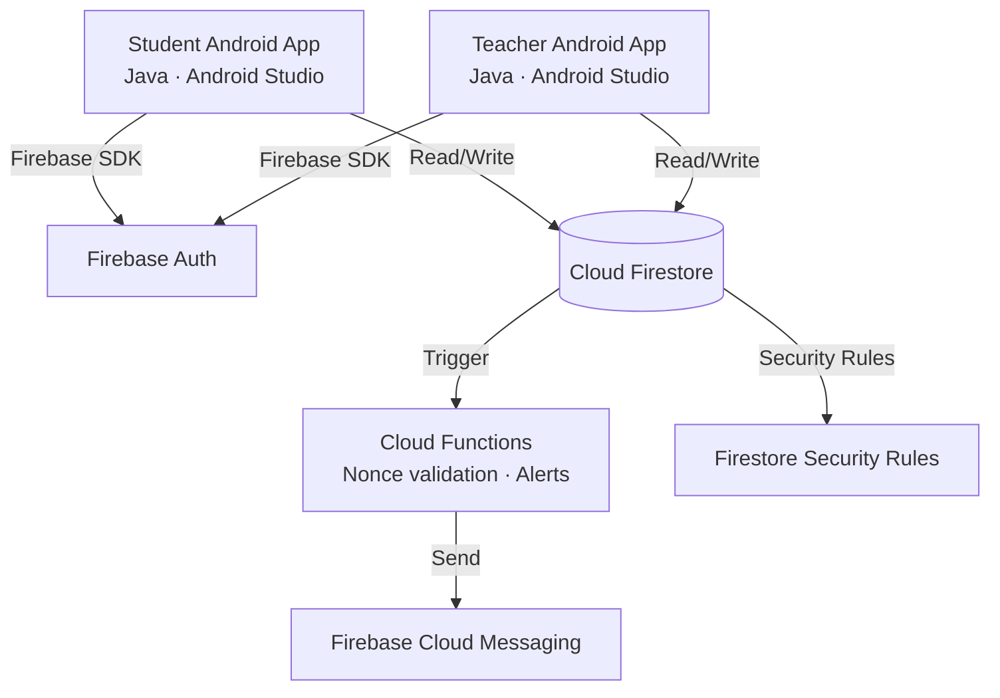
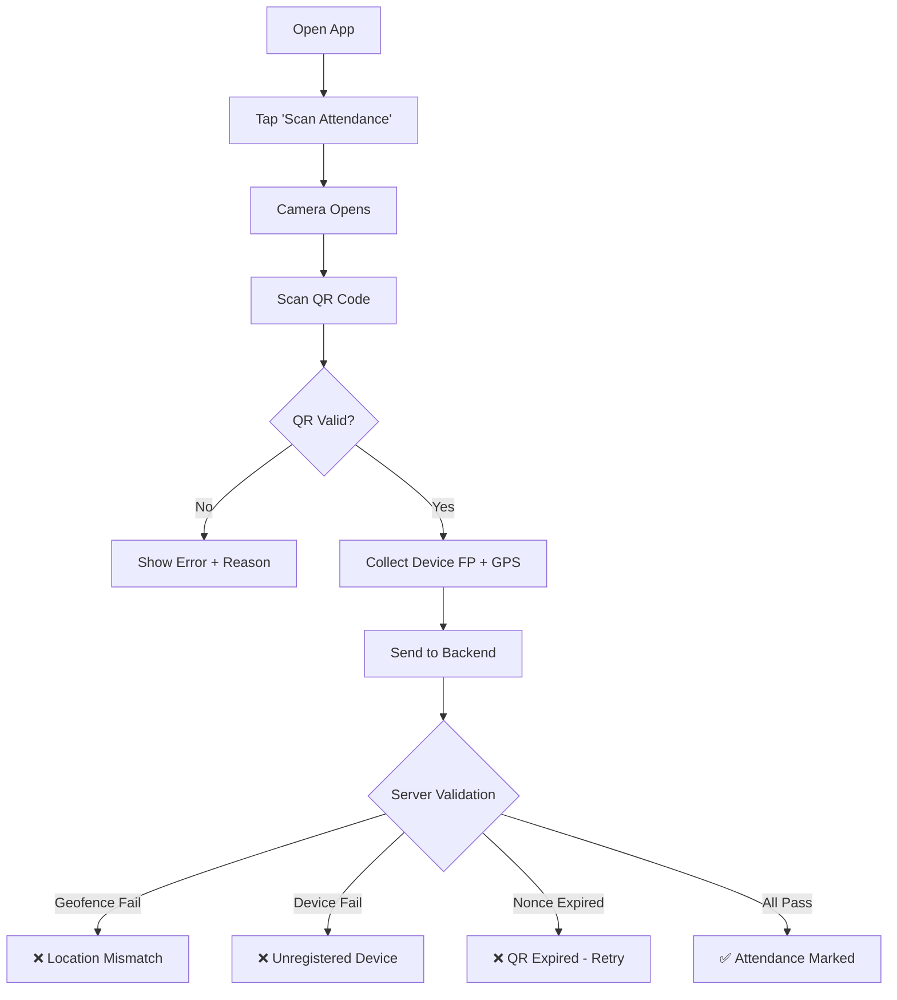
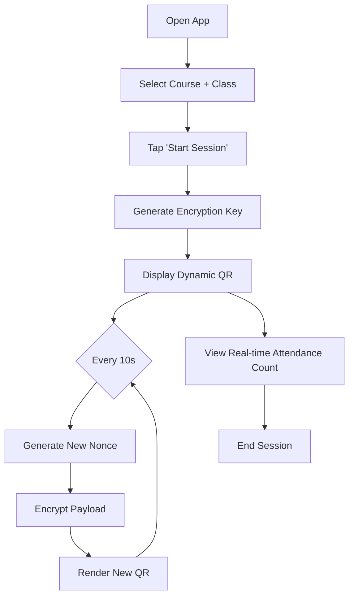
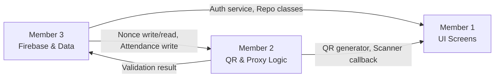

# Product Requirements Document (PRD)
# Student Attendance Management System — QR Code Based

| Field | Detail |
|---|---|
| **Product Name** | QR-Attend |
| **Platform** | Android (Android Studio / Java) |
| **Version** | 1.0 |
| **Date** | 2026-03-23 |
| **Author** | Product Team (3 Members) |

---

## 1. Executive Summary

QR-Attend is an Android application that automates student attendance using **dynamic QR codes** that refresh every **10 seconds**. The system incorporates robust **proxy prevention** through device fingerprinting, geolocation validation, and time-bound QR tokens — making it virtually impossible for students to mark attendance on behalf of others.

---

## 2. Problem Statement

| Current Pain Point | Impact |
|---|---|
| Manual roll-call is slow and error-prone | Wastes 5–10 min per lecture |
| Buddy-punching / proxy attendance is rampant | Inflated attendance records, unfair grading |
| Paper registers are hard to audit | Difficult to generate analytics or alerts |
| No real-time visibility for administration | Delayed intervention for chronic absentees |

---

## 3. Goals & Success Metrics

| Goal | KPI | Target |
|---|---|---|
| Eliminate proxy attendance | Proxy detection rate | ≥ 98 % |
| Speed up attendance marking | Time per student | < 5 seconds |
| Improve data accuracy | Discrepancy rate vs. manual audit | < 1 % |
| Drive adoption | Active users after 1 semester | ≥ 80 % of enrolled students |

---

## 4. Target Users

### 4.1 Students
- Mark attendance by scanning a QR code displayed by the teacher.
- View personal attendance history and statistics.

### 4.2 Teachers / Faculty
- Generate and display dynamic QR codes in class.
- View real-time class attendance and flag anomalies.
- Manually override attendance (with justification).

### 4.3 Admin / HOD
- Dashboard with department-wide attendance analytics.
- Configure policies (minimum attendance %, geofence radius, etc.).
- Manage users, courses, and semesters.

---

## 5. Core Features

### 5.1 Dynamic QR Code Generation (Teacher Side)

| Attribute | Specification |
|---|---|
| **Refresh interval** | Every **10 seconds** |
| **Payload** | Encrypted JSON: `{session_id, timestamp, random_nonce, teacher_id, course_id, geo_hash}` |
| **Encryption** | AES-256-GCM; key shared via secure handshake at session start |
| **Display** | Full-screen QR on teacher's Android device / projected onto screen |
| **Offline resilience** | QR generation works offline; sync when connectivity resumes |

#### How It Works
```
┌──────────────────────────────────────────────┐
│  Teacher App                                 │
│  ┌─────────┐   every 10s   ┌──────────────┐ │
│  │ Session  │──────────────▶│ Generate new  │ │
│  │ Manager  │               │ QR payload +  │ │
│  │          │◀──────────────│ render QR     │ │
│  └─────────┘   display      └──────────────┘ │
└──────────────────────────────────────────────┘
```

### 5.2 QR Code Scanning & Attendance Marking (Student Side)

1. Student opens the app and taps **"Scan Attendance"**.
2. Camera opens → scans the currently displayed QR code.
3. App decrypts the QR payload and validates:
   - Timestamp is within ±15 s window.
   - Session ID matches an active class.
4. App bundles scan data **+ device fingerprint + GPS coordinates** and sends to the backend.
5. Backend validates all checks (§5.3) → returns **✅ Marked** or **❌ Rejected** with reason.

### 5.3 Proxy Prevention — Three-Layer Defence

#### Layer 1 — Device Fingerprinting

| Signal Collected | Purpose |
|---|---|
| `ANDROID_ID` | Unique per-device per-app installation |
| Hardware serial / Build fingerprint | Ties attendance to a physical device |
| SIM / IMEI hash (with permission) | Detects SIM-swap or emulator use |
| Installed app signature hash | Prevents modified APK usage |
| Screen resolution + density | Additional device profiling |

**Rules:**
- Each student account is bound to **max 2 devices** (configurable).
- Device binding requires OTP verification.
- If a new device is detected, the student must request an **admin-approved device change**.
- Attendance from **emulators, rooted devices, or VPNs** is auto-rejected.

#### Layer 2 — Geolocation Validation

| Parameter | Value |
|---|---|
| **Geofence type** | Circular radius around classroom GPS coordinates |
| **Default radius** | 50 meters (admin-configurable per room) |
| **Location source** | Fused Location Provider (GPS + Wi-Fi + Cell) |
| **Mock location detection** | Reject if `Location.isFromMockProvider()` returns true |
| **Staleness check** | Location fix must be < 30 seconds old |
| **Wi-Fi BSSID match** (optional) | Cross-check against known classroom Wi-Fi access points |

**Rules:**
- Student's GPS must be within the geofence at scan time.
- Location spoofing apps are detected and flagged.
- Backend cross-validates student coordinates against the teacher's reported location.

#### Layer 3 — Dynamic QR Temporal Validation

| Check | Detail |
|---|---|
| **Time window** | QR nonce valid for only 10 seconds |
| **One-time use** | Each nonce can be redeemed by a student **only once** |
| **Replay protection** | Server stores used nonces; rejects duplicates |
| **Screenshot protection** | QR expires before a screenshot can be shared and scanned |

### 5.4 Attendance Dashboard & Analytics

#### Student View
- Subject-wise attendance percentage (pie/bar charts).
- Alerts when attendance drops below threshold.
- History log with date, time, subject, and status.

#### Teacher View
- Real-time class attendance count during active session.
- Flagged entries (location mismatch, device anomaly).
- Export to CSV / PDF.

#### Admin View
- Department-wide attendance heatmaps.
- Chronic absentee reports with auto-generated warning emails.
- Audit trail for manual overrides.

### 5.5 Notification System

| Trigger | Notification |
|---|---|
| Attendance < threshold | Push notification + in-app alert to student |
| Proxy attempt detected | Alert to teacher + admin |
| Device change request | Push to admin for approval |
| Session started | Push to enrolled students |

---

## 6. Technical Architecture

### 6.1 High-Level Architecture (Serverless — Firebase)



> [!NOTE]
> No custom backend server is needed. All business logic runs inside the Android apps and **Firebase Cloud Functions** (optional, for server-side nonce validation and push notifications).

### 6.2 Tech Stack

| Layer | Technology |
|---|---|
| **IDE / Language** | Android Studio · **Java** |
| **UI** | XML Layouts + Material Design Components |
| **Authentication** | Firebase Authentication (Email/Password + Google Sign-In) |
| **Database** | Cloud Firestore (NoSQL, real-time sync) |
| **QR Generation** | ZXing (`com.journeyapps:zxing-android-embedded`) |
| **QR Scanning** | Google ML Kit Barcode Scanning API |
| **Location** | Google Play Services Fused Location Provider |
| **Push Notifications** | Firebase Cloud Messaging (FCM) |
| **Server-side Logic** | Firebase Cloud Functions (Node.js — minimal) |
| **Analytics** | Firebase Analytics + Crashlytics |
| **Build** | Gradle (AGP) |

### 6.3 Data Model — Firestore Collections (Final)

> [!NOTE]
> We evaluated two schemas and chose a **hybrid** of your simpler model + extra security fields. See comparison in §6.4 below.

```
Firestore Root
│
├── students (collection)
│   └── {studentId}
│       ├── name: "Rahul Sharma"
│       ├── rollNo: "CS21"
│       ├── class: "TY BSc CS"
│       ├── email: "rahul@gmail.com"
│       ├── phone: "9876543210"
│       ├── deviceId: "abcd1234"           // primary device fingerprint
│       ├── deviceId2: ""                   // optional 2nd device
│       └── fcmToken: "..."
│
├── teachers (collection)
│   └── {teacherId}
│       ├── name: "Mr. Patil"
│       ├── email: "patil@college.edu"
│       ├── subject: "Data Structures"
│       ├── classroom: "Room 301"
│       └── fcmToken: "..."
│
├── classes (collection)
│   └── {classId}
│       ├── className: "TY BSc CS"
│       ├── subject: "DSA"
│       ├── teacherId: "teacherId_001"
│       └── enrolledStudents: [studentId_001, ...]  // array of IDs
│
├── attendanceSessions (collection)
│   └── {sessionId}   // e.g. session_2026_03_23_10AM
│       ├── classId: "class_001"
│       ├── teacherId: "teacherId_001"
│       ├── qrCode: "RANDOM_TOKEN_12345"   // current nonce (rotated every 10s)
│       ├── latitude: 19.9975
│       ├── longitude: 73.7898
│       ├── geofenceRadius: 50             // meters
│       ├── startTime: timestamp
│       ├── endTime: timestamp
│       ├── active: true
│       │
│       └── records (subcollection)        // ⬅ attendance as subcollection
│           └── {studentId}
│               ├── status: "present" | "rejected"
│               ├── time: timestamp
│               ├── deviceId: "abcd1234"
│               ├── deviceLocationLat: 19.9976
│               ├── deviceLocationLong: 73.7897
│               └── rejectionReason: "" | "location_mismatch" | "device_mismatch" | "nonce_expired"
```

> [!NOTE]
> **No `nonceLogs` collection needed.** The `records` subcollection uses `{studentId}` as document ID — Firestore prevents duplicate writes automatically. Nonce validation is done by comparing the scanned nonce against the session's current `qrCode` field.

### 6.4 Data Model Comparison — Why This Hybrid?

| Aspect | Your Original Model | PRD v1 Model | ✅ Final Hybrid |
|---|---|---|---|
| **Student/Teacher separation** | Separate `students` + `teachers` collections | Single `users` collection with `role` field | **Separate** — simpler queries, no role filtering needed |
| **Attendance storage** | `records` as **subcollection** under session | `attendanceRecords` as **top-level** collection | **Subcollection** — natural grouping, no composite indexes needed, atomic reads per session |
| **Session naming** | Readable IDs like `session_2026_02_17_10AM` | Auto-generated IDs | **Readable IDs** — easier to debug and reference |
| **Location on session** | `latitude`, `longitude` on session doc | Separate `classrooms` collection | **On session doc** — simpler, avoids extra read |
| **Device fingerprint** | Single `deviceId` field | Array `deviceFingerprints[]` | **Two fields** `deviceId` + `deviceId2` — simpler than array, supports max 2 |
| **Security fields** | ❌ Missing `rejectionReason` | ✅ Full security fields | ✅ **Added** `rejectionReason` on records |
| **Geofence radius** | ❌ Missing | ✅ In classrooms collection | ✅ **Added** directly on `attendanceSessions` doc |
| **FCM token** | ❌ Missing | ✅ Present | ✅ **Added** to both `students` and `teachers` |

> [!TIP]
> The subcollection pattern (`attendanceSessions/{sessionId}/records/{studentId}`) is the **best Firestore practice** here because:
> - You always query attendance per-session ("who attended this class?") — subcollection makes this a single collection read
> - The `studentId` as document ID prevents duplicate attendance (Firestore doc IDs are unique)
> - No composite indexes needed vs. top-level collection needing `sessionId + studentId` index

---

## 7. Security Requirements

| Requirement | Implementation |
|---|---|
| Data in transit | TLS 1.2+ (handled by Firebase SDK) |
| Data at rest | Firestore encryption at rest (Google-managed keys) |
| QR payload | AES-256-GCM encrypted, HMAC-signed |
| Auth | Firebase Auth (email/password + Google Sign-In) |
| Firestore access control | Firestore Security Rules — role-based read/write |
| Root / emulator detection | Play Integrity API |
| APK integrity | ProGuard / R8 code obfuscation |
| Rate limiting | Firestore Security Rules + Cloud Function checks |
| Privacy | Collect only essential data; no IMEI without consent |

---

## 8. User Flows

### 8.1 Student — Mark Attendance



### 8.2 Teacher — Start Session



---

## 9. Non-Functional Requirements

| Category | Requirement |
|---|---|
| **Performance** | QR scan → confirmation in < 2 seconds (on 4G) |
| **Scalability** | Support 10,000+ concurrent users per institution |
| **Availability** | 99.5 % uptime SLA |
| **Offline Support** | Teachers can generate QR offline; sync later |
| **Min Android Version** | Android 8.0 (API 26) |
| **Accessibility** | High-contrast QR display, screen-reader support |
| **Localization** | English + Hindi (expandable) |

---

## 10. Timeline — With Antigravity AI Assistance

### Why ~4 Weeks Instead of 14?

With **Antigravity** (AI pair programmer) assisting all 3 members simultaneously:

| Activity | Without AI | With Antigravity | Savings |
|---|---|---|---|
| Boilerplate (Activities, XML, adapters) | 3–4 weeks | **2–3 days** | ~85 % |
| Firebase setup + CRUD repos | 2 weeks | **1–2 days** | ~80 % |
| QR encryption/decryption logic | 2 weeks | **2–3 days** | ~75 % |
| Geolocation + device FP modules | 2 weeks | **2–3 days** | ~75 % |
| Debugging + integration | 3 weeks | **3–4 days** | ~70 % |
| UI polish + testing | 2 weeks | **2–3 days** | ~70 % |
| **Total** | **~14 weeks** | **~3.5–4 weeks** | **~75 %** |

> [!IMPORTANT]
> This assumes each member works **4–5 hours/day** and uses Antigravity for code generation, debugging, and boilerplate. Real bottleneck will be **integration + on-device testing**, which can't be fully AI-automated.

### Sprint Plan (4 Weeks)

| Week | Focus | Milestone |
|---|---|---|
| **Week 1** | Foundation — Auth, Firestore, project setup, all screen layouts, QR generation | Login works, dummy screens navigable, QR displays |
| **Week 2** | Core features — QR scanning, device fingerprint, geo validation, dashboards connected to Firestore | Student can scan QR and attendance writes to Firestore |
| **Week 3** | Security & polish — Proxy detection engine, nonce rotation, rejection reasons, teacher live view, admin panel | Full proxy prevention working end-to-end |
| **Week 4** | Integration, testing, polish — Bug fixes, edge cases, UI animations, APK build | **v1.0 APK ready for demo** |

---

## 11. Team Work Division (3 Members)

### Team Roles Overview

| Member | Role | Primary Responsibility |
|---|---|---|
| **Member 1** | Frontend & UX Lead | All Android UI screens, navigation, Material Design |
| **Member 2** | Core Logic & QR Lead | QR generation (ZXing), QR scanning (ML Kit), proxy prevention |
| **Member 3** | Backend & Integration Lead | Firebase Auth, Firestore CRUD, Security Rules, FCM |

---

### Member 1 — Frontend & UX Lead

| Week | Deliverables |
|---|---|
| **Week 1** | Project structure, splash screen, login/signup UI, student dashboard, teacher dashboard layouts |
| **Week 2** | QR display screen (full-screen), QR scanner screen (camera preview), attendance history list |
| **Week 3** | Admin panel screens, attendance charts (MPAndroidChart), notification UI, settings |
| **Week 4** | UI polish, animations, dark mode, error states, integration testing with Members 2 & 3 |

---

### Member 2 — Core Logic & QR Lead

| Week | Deliverables |
|---|---|
| **Week 1** | ZXing integration — generate encrypted QR, 10s auto-refresh timer, AES-256-GCM util |
| **Week 2** | ML Kit barcode scanning, device fingerprinting module, geolocation validator |
| **Week 3** | Proxy detection engine (combine all checks), nonce manager, mock location detection |
| **Week 4** | Play Integrity API, edge-case testing, unit tests, integration with Member 1's screens |

---

### Member 3 — Backend & Integration Lead

| Week | Deliverables |
|---|---|
| **Week 1** | Firebase project setup, Auth flows (email + Google), Firestore schema + all CRUD repos |
| **Week 2** | Attendance session management, real-time listeners, nonceLogs collection |
| **Week 3** | Firestore Security Rules, device binding logic, FCM push notifications |
| **Week 4** | CSV/PDF export, Crashlytics setup, Firestore indexes, APK signing, final integration |

---

### Shared / Collaborative Tasks

| Task | Members | When |
|---|---|---|
| Project structure + package agreement | All 3 | Day 1 |
| Interface contracts (Java interfaces) | All 3 | Day 1–2 |
| Integration checkpoint | All 3 | End of Week 2 |
| Full integration testing | All 3 | Week 4 |
| Bug fixing & QA | All 3 | Week 4 |
| APK build & distribution | Member 3 + Member 1 | Week 4 |

---

### Dependency Graph



> [!IMPORTANT]
> **Member 3** must deliver Firebase Auth + basic Firestore CRUD by **end of Day 3** so Members 1 and 2 can build on real data.

---

## 12. GitHub Repository — File Structure & Ownership

Below is every file the repo should contain, with member ownership marked.

🔵 = Member 1 (Frontend) · 🟢 = Member 2 (Core Logic) · 🟠 = Member 3 (Backend) · ⚪ = Shared

```
QR-Attend/
├── .gitignore                                          ⚪
├── README.md                                           ⚪
├── build.gradle (project-level)                        ⚪
├── settings.gradle                                     ⚪
├── gradle.properties                                   ⚪
│
├── app/
│   ├── build.gradle (app-level)                        ⚪
│   ├── google-services.json                            🟠  (git-ignored)
│   ├── proguard-rules.pro                              🟠
│   │
│   └── src/main/
│       ├── AndroidManifest.xml                         ⚪
│       │
│       ├── java/com/qrattend/app/
│       │   │
│       │   ├── ui/                                     🔵 MEMBER 1
│       │   │   ├── SplashActivity.java
│       │   │   ├── LoginActivity.java
│       │   │   ├── SignupActivity.java
│       │   │   ├── StudentDashboardActivity.java
│       │   │   ├── AttendanceHistoryActivity.java
│       │   │   ├── ScanQRActivity.java
│       │   │   ├── TeacherDashboardActivity.java
│       │   │   ├── StartSessionActivity.java
│       │   │   ├── DisplayQRActivity.java
│       │   │   ├── SessionAttendanceActivity.java
│       │   │   ├── AdminDashboardActivity.java
│       │   │   ├── ManageUsersActivity.java              // handles both students & teachers
│       │   │   ├── ManageClassesActivity.java
│       │   │   ├── SettingsActivity.java                  // includes profile editing
│       │   │   └── adapters/
│       │   │       ├── AttendanceRecordAdapter.java
│       │   │       ├── UserListAdapter.java                // reused for students & teachers
│       │   │       └── ClassListAdapter.java               // reused for courses & sessions
│       │   │
│       │   ├── qr/                                     🟢 MEMBER 2
│       │   │   ├── QRGeneratorUtil.java                    // ZXing — generate encrypted QR
│       │   │   ├── QRScannerUtil.java                     // ML Kit — decode + decrypt
│       │   │   └── QRRefreshManager.java                  // 10s timer + nonce rotation
│       │   │
│       │   ├── security/                                🟢 MEMBER 2
│       │   │   ├── AESCryptoUtil.java                     // AES-256-GCM encrypt/decrypt
│       │   │   ├── DeviceFingerprint.java                 // ANDROID_ID, Build info + root/emulator detect
│       │   │   └── NonceManager.java                      // Generate + validate nonces
│       │   │
│       │   ├── location/                                🟢 MEMBER 2
│       │   │   ├── LocationHelper.java                    // Fused Location Provider
│       │   │   └── GeoValidator.java                      // Geofence + mock location detect
│       │   │
│       │   ├── proxy/                                   🟢 MEMBER 2
│       │   │   └── ProxyDetectionEngine.java              // Orchestrator: all checks → accept/reject
│       │   │
│       │   ├── data/                                    🟠 MEMBER 3
│       │   │   ├── model/
│       │   │   │   ├── Student.java
│       │   │   │   ├── Teacher.java
│       │   │   │   ├── ClassInfo.java
│       │   │   │   ├── AttendanceSession.java
│       │   │   │   └── AttendanceRecord.java
│       │   │   │
│       │   │   └── repository/
│       │   │       ├── StudentRepository.java
│       │   │       ├── TeacherRepository.java
│       │   │       ├── ClassRepository.java
│       │   │       ├── SessionRepository.java             // includes nonce validation
│       │   │       └── AttendanceRepository.java
│       │   │
│       │   ├── firebase/                                🟠 MEMBER 3
│       │   │   ├── AuthManager.java                       // login/signup/logout
│       │   │   └── FCMService.java                        // push notifications
│       │   │
│       │   └── utils/                                   ⚪ SHARED
│       │       └── Constants.java                         // app-wide constants
│       │
│       └── res/                                         🔵 MEMBER 1
│           ├── layout/
│           │   ├── activity_splash.xml
│           │   ├── activity_login.xml
│           │   ├── activity_signup.xml
│           │   ├── activity_student_dashboard.xml
│           │   ├── activity_attendance_history.xml
│           │   ├── activity_scan_qr.xml
│           │   ├── activity_teacher_dashboard.xml
│           │   ├── activity_start_session.xml
│           │   ├── activity_display_qr.xml
│           │   ├── activity_session_attendance.xml
│           │   ├── activity_admin_dashboard.xml
│           │   ├── activity_manage_users.xml
│           │   ├── activity_manage_classes.xml
│           │   ├── activity_settings.xml
│           │   ├── item_attendance_record.xml
│           │   ├── item_user.xml
│           │   └── item_class.xml
│           │
│           ├── values/
│           │   ├── colors.xml
│           │   ├── strings.xml
│           │   └── themes.xml
│           │
│           ├── drawable/
│           ├── mipmap/
│           └── menu/
│
├── firestore.rules                                      🟠 MEMBER 3
│
└── docs/
    ├── PRD.md                                           ⚪
    └── SETUP.md                                         🟠
```

### What Was Removed / Merged

| Removed | Merged Into | Why |
|---|---|---|
| `ProfileActivity` + XML | `SettingsActivity` | Profile editing is just a section in settings |
| `ManageStudentsActivity` + `ManageTeachersActivity` | `ManageUsersActivity` | Same screen, different data — one Activity with a tab/toggle |
| `IntegrityChecker.java` | `DeviceFingerprint.java` | Root/emulator check is part of fingerprinting |
| `MockLocationDetector.java` | `GeoValidator.java` | Mock detection is part of geo validation |
| `FirestoreHelper.java` | Individual repositories | Each repo gets its own Firestore instance — simpler |
| `NonceLog.java` + `NonceRepository.java` | `SessionRepository` | No separate nonce collection needed (see §6.3 note) |
| `ExportUtil.java` + `TimeUtils.java` | Deferred to v1.1 | Not essential for v1.0 demo |
| `StudentListAdapter` + `SessionListAdapter` + `CourseListAdapter` | `UserListAdapter` + `ClassListAdapter` | Reusable adapters with different data |
| `QRAttendApp.java` | Not needed | No custom Application class needed for v1.0 |
| `CONTRIBUTING.md` + `firestore.indexes.json` + `dimens.xml` | Removed | Not needed for 3-person team |

### File Count Per Member (Simplified)

| Member | Java Files | XML Layouts | Other | Total |
|---|---|---|---|---|
| 🔵 **Member 1** | 14 Activities + 3 Adapters = 17 | 17 layouts + values | — | ~30 files |
| 🟢 **Member 2** | 7 Java files | — | — | 7 files |
| 🟠 **Member 3** | 5 models + 5 repos + 2 firebase = 12 | — | `firestore.rules`, `SETUP.md` | ~14 files |
| ⚪ **Shared** | 1 Java file | `AndroidManifest.xml` | `README.md`, gradle files | ~7 files |

---

## 13. Release Plan

| Phase | Scope | Timeline |
|---|---|---|
| **Alpha** | Auth + QR generation/scanning + basic attendance log | End of Week 2 |
| **Beta** | Device FP + geo validation + proxy detection + dashboards | End of Week 3 |
| **v1.0** | Admin panel, notifications, charts, polish, APK signed | End of Week 4 |
| **v1.1** | Wi-Fi BSSID, offline mode, multi-language | Post-launch |

---

> [!TIP]
> With Antigravity assisting all 3 members, the **critical path** is integration testing in Week 4. All individual modules can be built in parallel during Weeks 1–3.

## 14. Risks & Mitigations

| Risk | Impact | Mitigation |
|---|---|---|
| Students deny location permission | Can't validate geofence | Make location permission mandatory; no scan without it |
| GPS inaccuracy indoors | False rejections | Use Wi-Fi + cell triangulation; increase geofence radius for problem rooms |
| Device change is cumbersome | Poor UX | Allow self-service with OTP; 24-hr admin approval SLA |
| QR not visible in large halls | Students can't scan | Allow screen projection; increase QR size |
| Firebase quota limits | Free tier exhausted | Monitor usage; upgrade to Blaze plan if needed |
| Team member unavailable | Delays in dependent modules | Overlap knowledge via code reviews; documented interfaces |

---

## 15. Open Questions

| # | Question | Owner |
|---|---|---|
| 1 | Should we support iOS in v2? | Product |
| 2 | Firestore free tier sufficient or Blaze plan from start? | Member 3 |
| 3 | Integration with existing college ERP / LMS? | Product + IT |
| 4 | Min Android version — API 26 (8.0) or higher? | All |

---

## 16. Appendix

### A. Glossary

| Term | Definition |
|---|---|
| **Device Fingerprint** | A composite identifier derived from hardware and software attributes of a device |
| **Geofence** | A virtual geographic boundary defined by GPS coordinates and a radius |
| **Nonce** | A one-time-use random value embedded in each QR code to prevent replay attacks |
| **BSSID** | MAC address of a Wi-Fi access point, used as a location signal |
| **Fused Location Provider** | Android API combining GPS, Wi-Fi, and cell signals for accurate location |

### B. Competitive Analysis

| Feature | QR-Attend | Manual Roll | Biometric | Bluetooth Beacon |
|---|---|---|---|---|
| Speed | ⚡ Fast | 🐢 Slow | ⚡ Fast | ⚡ Fast |
| Proxy Prevention | ✅ Multi-layer | ❌ None | ✅ Strong | ⚠️ Medium |
| Hardware Cost | 💰 None (phones) | 💰 None | 💰💰💰 High | 💰💰 Medium |
| Scalability | ✅ High | ❌ Low | ⚠️ Medium | ⚠️ Medium |
| Offline Support | ✅ Partial | ✅ Full | ❌ None | ❌ None |
